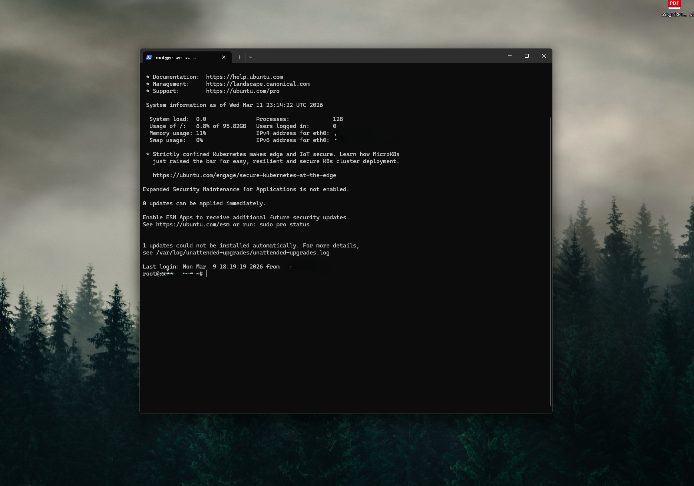
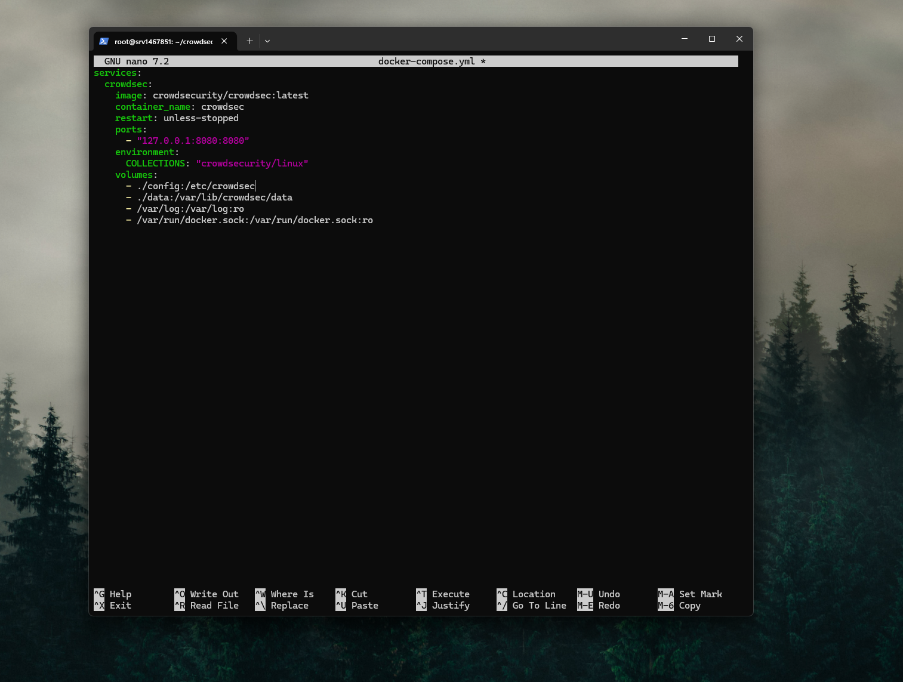
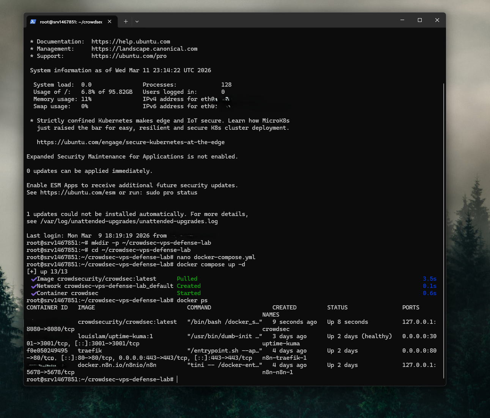
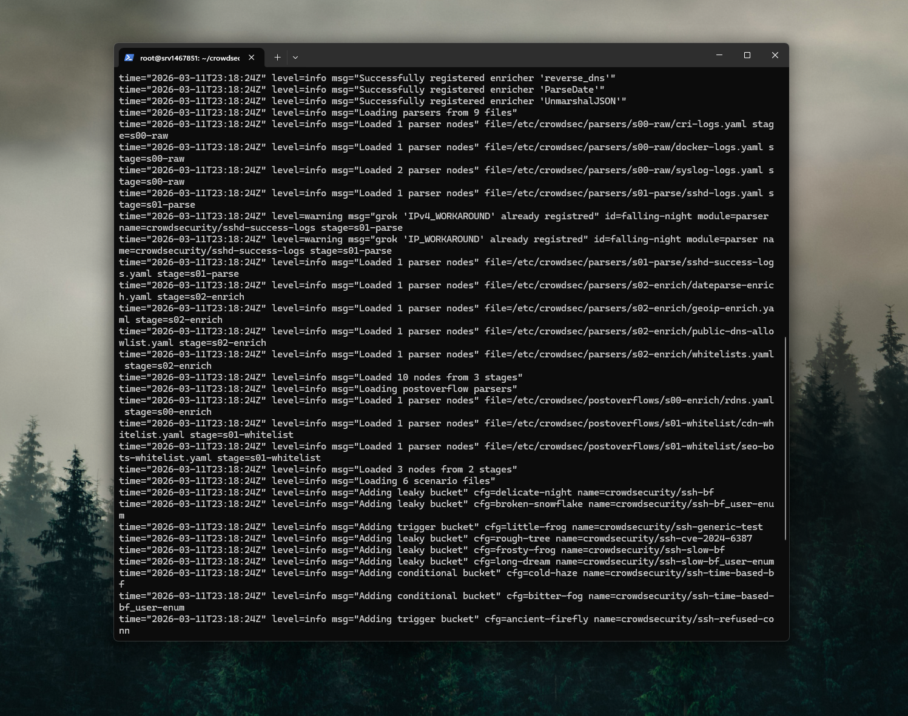
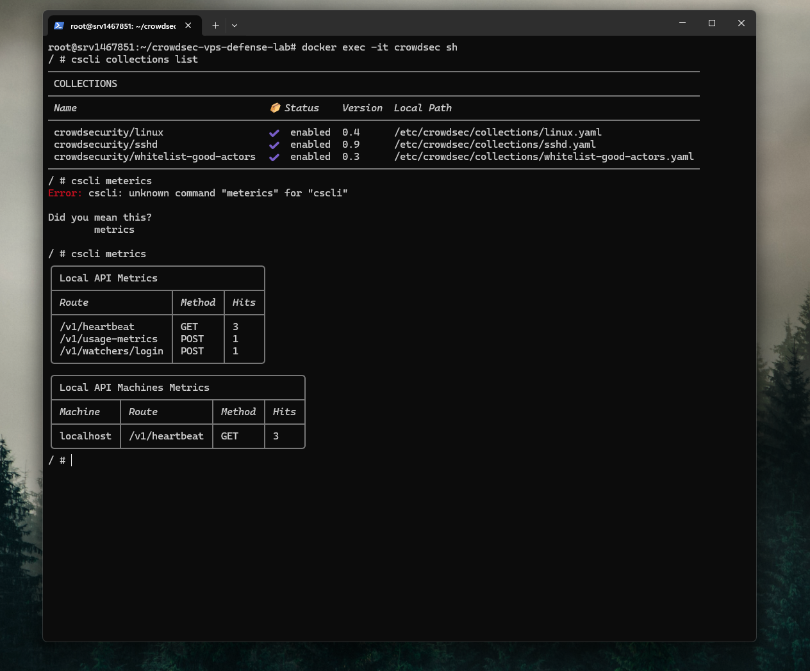
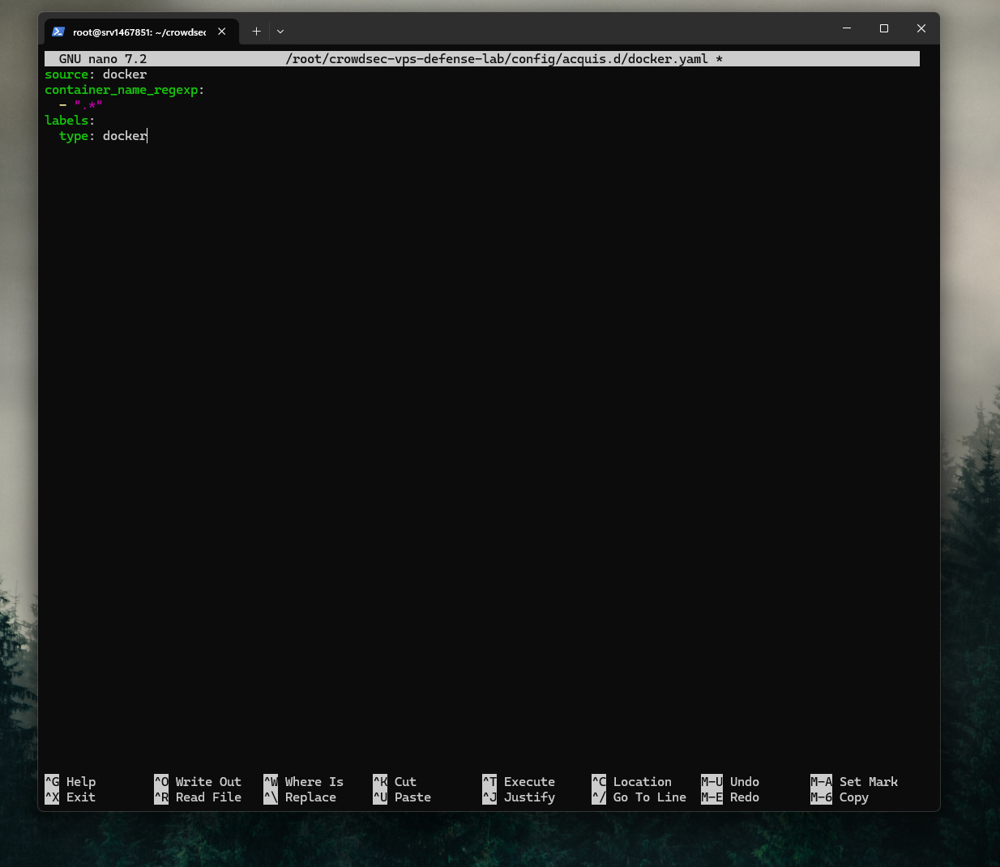
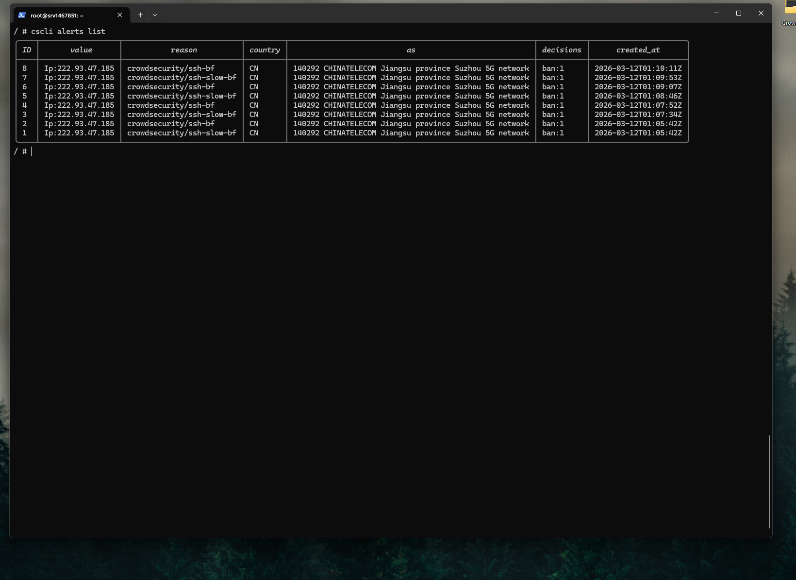
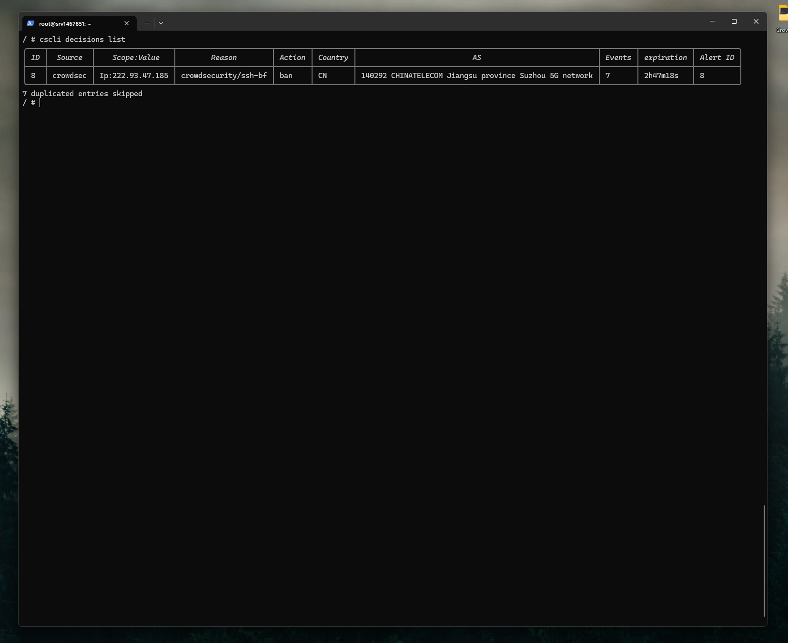
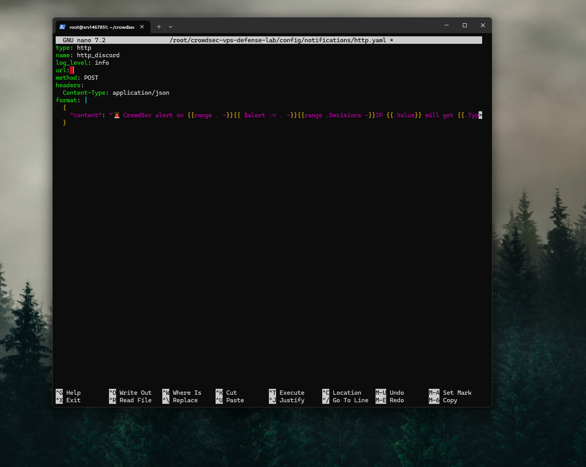
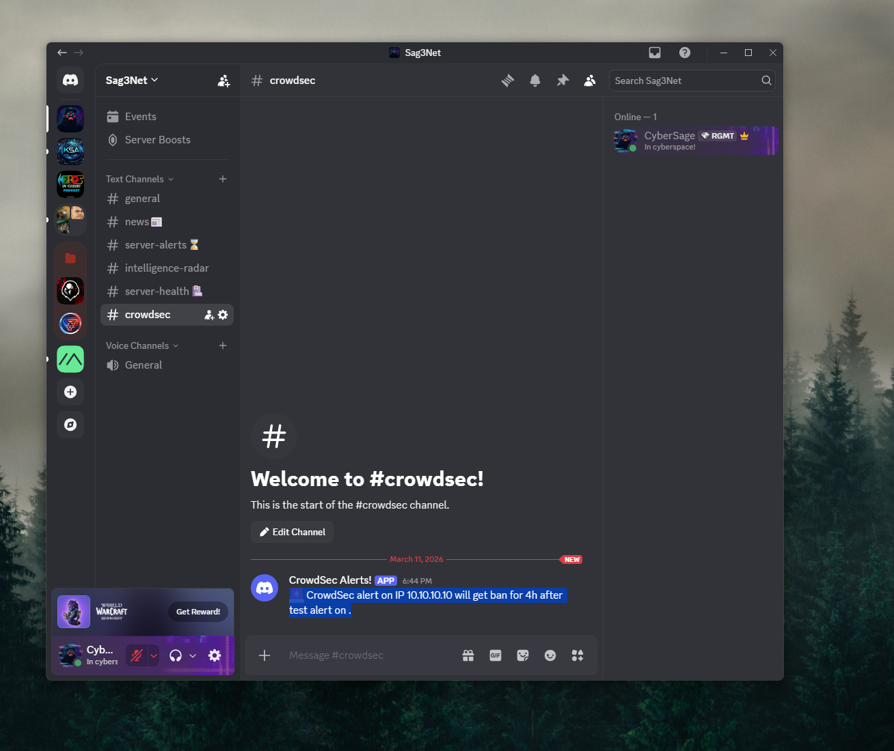

# CrowdSec VPS Defense Lab with Discord Alerts

## Overview

Built a Docker-based defensive security lab on a Hostinger VPS using CrowdSec to analyze Linux authentication logs and Docker logs for suspicious activity.

The goal of this project was to create a practical blue-team style monitoring workflow on a live internet-facing VPS without introducing unnecessary risk. The lab focused on deploying CrowdSec in Docker, monitoring host and container logs, validating SSH brute-force detections, and sending alerts to Discord through a webhook.

This project demonstrates practical skills in Linux administration, Docker deployment, security log analysis, detection validation, and alerting workflow troubleshooting.

* * *

## Architecture

Hostinger VPS  
↓  
Ubuntu  
↓  
Docker / Docker Compose  
↓  
CrowdSec Security Engine  
↓  
Linux auth log monitoring + Docker log monitoring  
↓  
CrowdSec HTTP notification plugin  
↓  
Discord webhook alerts

Component | Description
--- | ---
Hosting Provider | Hostinger VPS
Operating System | Ubuntu
Container Platform | Docker
Detection Tool | CrowdSec
Primary Host Log Source | `/var/log/auth.log`
Container Log Source | Docker socket acquisition
Notification Method | Discord webhook using CrowdSec HTTP notification plugin
Primary Goal | Detect suspicious SSH activity and send security alerts

## Objectives

- Deploy CrowdSec on a live VPS using Docker
- Monitor Linux SSH/authentication activity
- Add Docker log acquisition for container visibility
- Validate detections safely with controlled failed SSH logins
- Send CrowdSec alerts to Discord
- Build a practical security-focused Docker project for GitHub

* * *

## Step 1 — Initial VPS Preparation

The lab began on a Hostinger VPS already running Ubuntu. Initial preparation focused on connecting through SSH, creating a clean project directory, and preparing a Docker Compose deployment for CrowdSec.

Initial setup included:

- connecting to the VPS over SSH
- creating a dedicated CrowdSec project folder
- preparing a Docker Compose deployment
- keeping the project structure simple and reusable

### Project Directory

* * *

## Step 2 — CrowdSec Docker Deployment

CrowdSec was deployed with Docker Compose using a lightweight configuration that persisted data locally, mounted host log files into the container, and bound the CrowdSec local API to loopback only.

This phase included:

- creating a `docker-compose.yml`
- mounting `/var/log` read-only
- persisting CrowdSec data in a local `data` directory
- mounting the Docker socket
- starting the CrowdSec container

### Docker Compose File

### CrowdSec Container Running

* * *

## Step 3 — Initial Validation

After deployment, the CrowdSec container was reviewed from the terminal to verify a healthy startup and confirm that the Security Engine was running.

Initial validation included:

- reviewing container logs
- checking active collections
- using `cscli metrics`
- confirming the CrowdSec CLI worked correctly inside the container

### CrowdSec Container Logs

### CrowdSec Metrics

* * *

## Step 4 — Docker Log Acquisition

To extend the lab beyond host authentication events, Docker log acquisition was added using CrowdSec’s acquisition configuration. This made it possible for CrowdSec to monitor container activity in addition to host-level logs.

This phase included:

- creating an acquisition file under `config/acquis.d`
- enabling Docker as a CrowdSec data source
- restarting the container
- validating updated parser activity

### Docker Acquisition File

* * *

## Step 5 — Host Authentication Log Monitoring

At first, CrowdSec was only clearly parsing Docker logs. Additional work was needed to make sure the VPS authentication log was being ingested and analyzed correctly.

An acquisition file was added for:

- `/var/log/auth.log`

This phase included:

- confirming the host auth log existed
- mounting `/var/log` into the container
- adding an acquisition file for `auth.log`
- verifying that SSH-related parser activity started appearing in `cscli metrics`

* * *

## Step 6 — Detection Validation

To safely validate the lab, controlled failed SSH login attempts were generated from a trusted source. This created realistic authentication noise without introducing extra risk or exposing a decoy service.

During testing, it became clear that simply connecting and disconnecting from SSH was not enough. Real failed password attempts had to be made so that `auth.log` would contain entries such as:

- `Invalid user fakeuser`
- `authentication failure`
- `Failed password for invalid user fakeuser`

Once these events appeared in `auth.log`, CrowdSec began generating meaningful SSH brute-force detections.

* * *

## Step 7 — Real Detection Results

After host log ingestion and parsing were working correctly, CrowdSec began generating real alerts and decisions.

The lab successfully detected:

- SSH brute-force activity
- slow brute-force behavior
- repeated hostile SSH activity from an external public IP

This confirmed that the CrowdSec detection pipeline was functioning properly on a live internet-facing VPS.

### CrowdSec Alerts List

### CrowdSec Decisions List

* * *

## Step 8 — Discord Alerting Setup

To add practical alerting, CrowdSec’s HTTP notification plugin was configured to send messages to a Discord webhook.

This phase included:

- creating `notifications/http.yaml`
- defining the Discord webhook destination
- testing the webhook with `cscli notifications test`
- confirming direct Discord delivery worked

### Discord HTTP Plugin Configuration

### Discord Test Alert

* * *

## Step 9 — Notification Troubleshooting

Even though test alerts were reaching Discord, live SSH detections were not being forwarded at first.

The issue was traced to the active CrowdSec profile configuration in `profiles.yaml`.

What happened:

- `default_range_remediation` had `http_default` enabled
- `default_ip_remediation` did **not** have `http_default` enabled
- the SSH brute-force alerts were **IP-scoped**
- because `default_ip_remediation` matched first and used `on_success: break`, the notification flow stopped before Discord could be triggered

The fix was to enable:

- `http_default`

under:

- `default_ip_remediation`

After this correction, the profile logic matched the actual SSH alert scope correctly.

* * *

## Step 10 — Terminal Review

A major goal of the project was becoming more comfortable with Linux and Docker-based troubleshooting. Command-line validation was used throughout the lab to inspect containers, logs, parser behavior, alerts, decisions, and notifications.

Commands practiced included:

- `docker ps`
- `docker logs crowdsec`
- `docker exec -it crowdsec sh`
- `cscli metrics`
- `cscli alerts list`
- `cscli decisions list`
- `cscli notifications list`
- `cscli notifications test`
- `grep sshd /var/log/auth.log`

* * *

## What Happened During the Lab

This project turned into more than a simple installation exercise.

The lab revealed several important real-world lessons:

- Docker log monitoring worked before SSH detection was fully working
- reading a log file is not the same as parsing useful events from it
- CrowdSec required real failed password events, not just connection closes
- real SSH brute-force traffic from the internet was detected during the lab
- direct Discord notification testing can work even when live alert routing is not fully configured
- correct profile logic in `profiles.yaml` matters just as much as the notification plugin itself

One of the most interesting parts of the project was seeing CrowdSec detect live hostile SSH activity from an external public IP while the VPS was online.

* * *

## Challenges / Troubleshooting

A few areas required extra attention during the build:

- mounting the correct host log sources into the container
- understanding the difference between Docker log acquisition and host auth log acquisition
- creating real failed-password SSH events instead of simple connection-close events
- reading `cscli metrics` to determine whether logs were being acquired and parsed
- troubleshooting why Discord test alerts worked while live detections did not
- correcting the CrowdSec profile so IP-based alerts could trigger the HTTP notification plugin

These troubleshooting steps helped reinforce Linux administration, Docker operations, and defensive monitoring concepts.

* * *

## Skills Demonstrated

- Linux server administration
- Docker and Docker Compose deployment
- security log analysis
- defensive monitoring
- SSH log validation
- alert and decision review
- Discord webhook integration
- terminal-based troubleshooting
- blue-team style lab design

* * *

## Outcome

Successfully built a Docker-based CrowdSec defense lab on a VPS and used it to analyze Linux authentication logs and Docker logs for suspicious activity. The lab successfully generated real SSH brute-force detections and demonstrated how to send security alerts to Discord through CrowdSec’s HTTP notification system.

This project improved hands-on experience with Docker deployment, Linux troubleshooting, log-based detection, and alerting workflow design in a live server environment.

* * *

## Future Improvements

Planned future enhancements include:

- add a CrowdSec firewall bouncer for automatic blocking
- monitor reverse proxy or web application logs
- improve Discord alert formatting
- add severity-based alert filtering
- whitelist trusted IPs where appropriate
- expand the project into a broader VPS defense workflow
