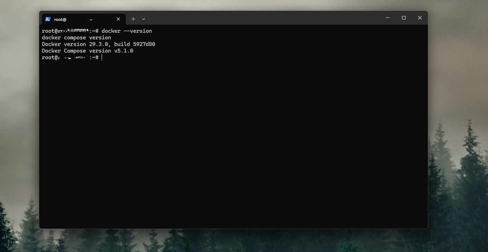
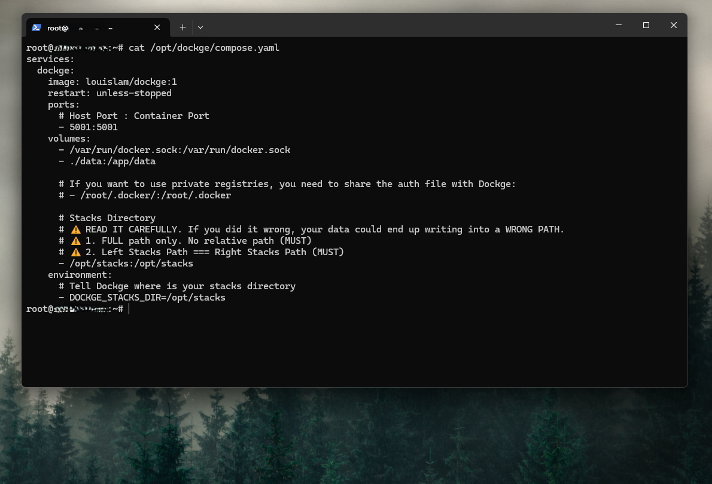
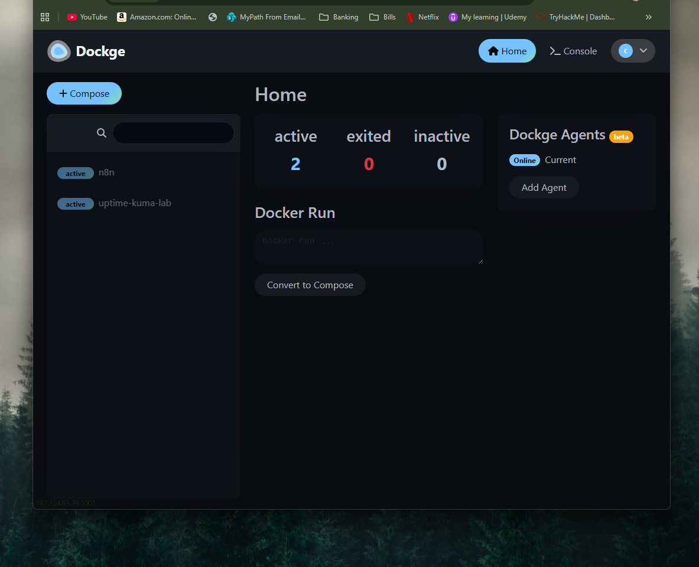

# Dockge VPS Management Lab

## Overview

Built a Docker Compose management lab on a Hostinger Ubuntu VPS using Dockge. The goal of this project was to create a cleaner way to deploy, organize, and manage self-hosted Docker stacks while gaining more hands-on experience with Linux, Docker, SSH, and terminal-based administration.

This lab demonstrates practical skills in Docker deployment, Linux server administration, and container management in a live VPS environment.

* * *

## Architecture

Hostinger VPS  
↓  
Ubuntu 24.04  
↓  
Docker Engine + Docker Compose  
↓  
Dockge  
↓  
Web-based Docker Compose stack management

Component | Description
--- | ---
Hosting Provider | Hostinger VPS
Operating System | Ubuntu 24.04
Container Platform | Docker Engine
Compose Management | Dockge
Access Method | SSH and web browser
Primary Purpose | Manage and organize Docker Compose stacks

## Objectives

- Deploy Dockge on a live Ubuntu VPS
- Install and verify Docker Engine and Docker Compose
- Create a structure for managing Docker stacks
- Gain hands-on experience using Docker from the terminal
- Build a reusable Docker management platform for future home lab projects

* * *

## Step 1 — Initial VPS Preparation

The project began on a Hostinger VPS running Ubuntu 24.04. Initial preparation included connecting through SSH, updating the operating system, and confirming administrative access before installing Docker components.

Initial setup included:

- Connecting to the VPS with SSH
- Updating system packages
- Verifying sudo access
- Checking whether Docker was already installed

### Initial System Update
[Add screenshot here]

* * *

## Step 2 — Docker Engine and Docker Compose Verification

Docker Engine was verified by compsed verison 

This phase included:

- Verifying Docker and Compose versions
- Testing Docker access from the command line

### Docker Version Check

* * *

## Step 3 — Dockge Deployment

After Docker was installed, directories were created to separate Dockge itself from future Docker Compose application stacks. Dockge’s official `compose.yaml` file was then downloaded to the VPS and started with Docker Compose.

Deployment steps included:

- Creating `/opt/dockge`
- Creating `/opt/stacks`
- Downloading Dockge’s `compose.yaml`
- Launching Dockge with `docker compose up -d`

### Dockge Compose File

* * *

## Step 4 — Accessing the Dockge Web Interface

Once the container was running, Dockge was accessed through its web interface on port 5001. Firewall and port access were validated to ensure the dashboard was reachable from a browser.

This step included:

- Confirming the Dockge container was running
- Verifying port 5001 was listening
- Allowing firewall access if needed
- Opening Dockge in a browser

### Dockge Dashboard

* * *

## Step 5 — Docker and Terminal Validation

A major goal of this lab was becoming more comfortable with Linux and terminal-based administration. After deployment, several Docker and Linux commands were used to validate the environment and inspect container activity.

Commands practiced included:

- `docker ps`
- `docker ps -a`
- `docker compose ps`
- `docker compose logs`
- `ss -tulpn`
- `ls -lah`
- `cat /opt/dockge/compose.yaml`

### Terminal Validation
[Add screenshot here]

* * *

## Step 6 — Stack Management Preparation

To prepare for future self-hosted services, a dedicated stacks directory was created. This made Dockge ready to manage future projects such as monitoring tools, reverse proxies, logging tools, and other Docker-based home lab services.

Preparation included:

- Creating a reusable stack directory
- Setting permissions for stack management
- Organizing the VPS for future Docker Compose deployments

* * *

## Challenges / Troubleshooting

A few common Docker administration issues were reviewed during the project:

- Verifying whether Docker Compose was installed correctly
- Confirming firewall and port access to the Dockge web interface
- Checking running containers and logs from the terminal
- Making sure the VPS directory structure was organized for future stacks

These troubleshooting steps helped reinforce Docker basics and improved comfort with Linux CLI tools.

* * *

## Skills Demonstrated

- Linux server administration
- SSH-based remote management
- Docker Engine installation
- Docker Compose deployment
- Container troubleshooting
- Terminal-based validation and log review
- VPS management
- Docker stack organization

* * *

## Outcome

Successfully deployed Dockge on a live Ubuntu VPS and created a structured environment for managing Docker Compose applications. This project provided hands-on practice with Linux administration, Docker deployment, terminal troubleshooting, and container management in a way that will support future self-hosted home lab projects.

* * *

## Future Improvements

Planned future enhancements include:

- Use Dockge to manage existing services such as n8n and Uptime Kuma
- Add Portainer or Dozzle for additional management and logging visibility
- Deploy Nginx Proxy Manager for cleaner access to self-hosted services
- Create additional Docker Compose stacks for cybersecurity-focused projects
- Add monitoring and backup procedures for Docker services
