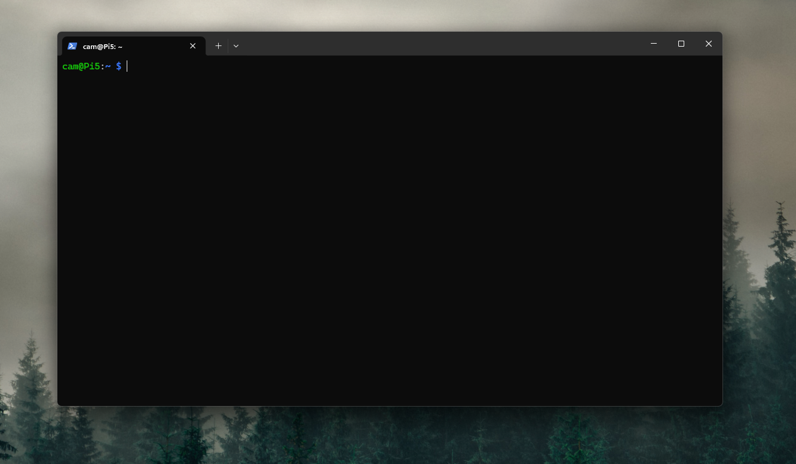
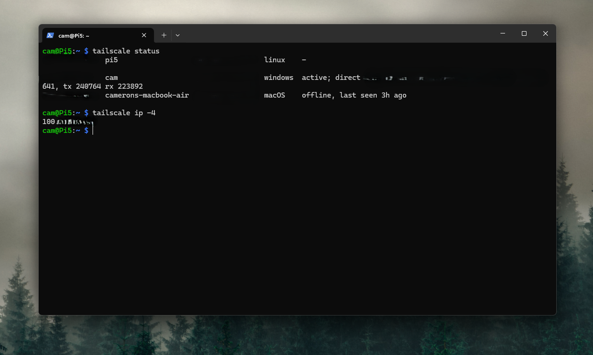
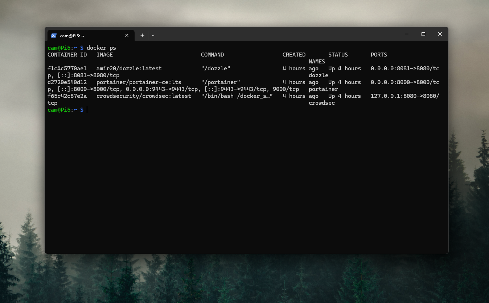
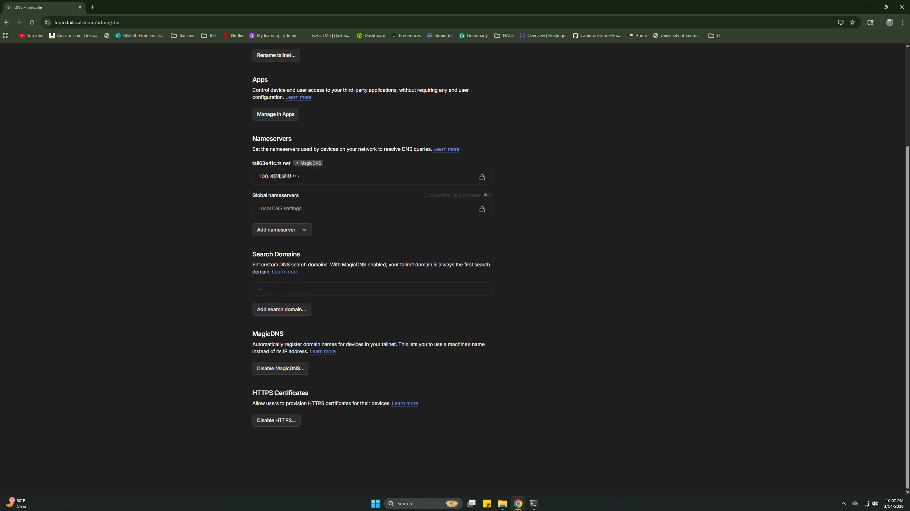
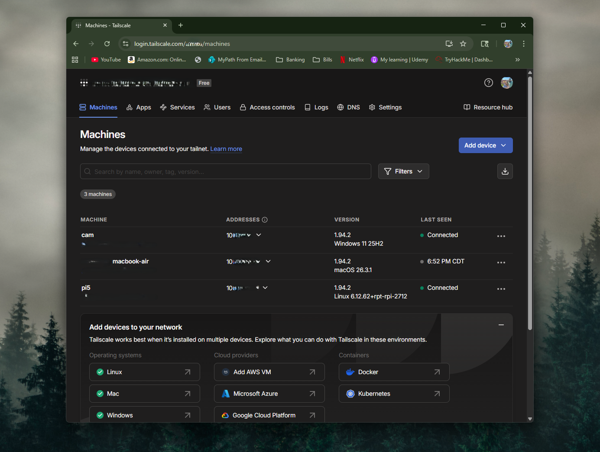
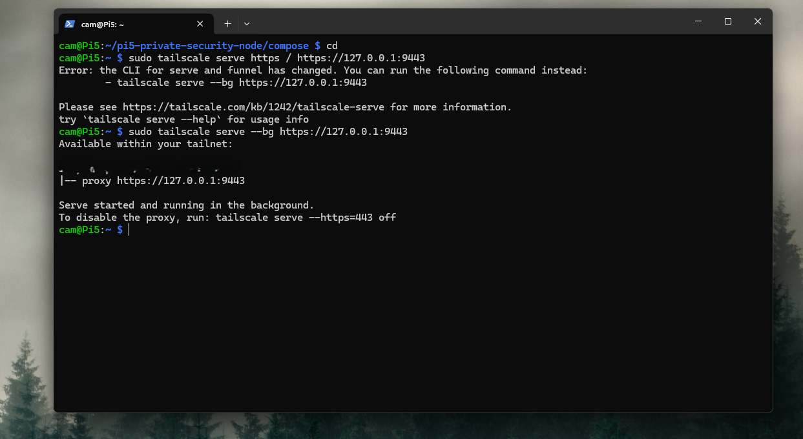
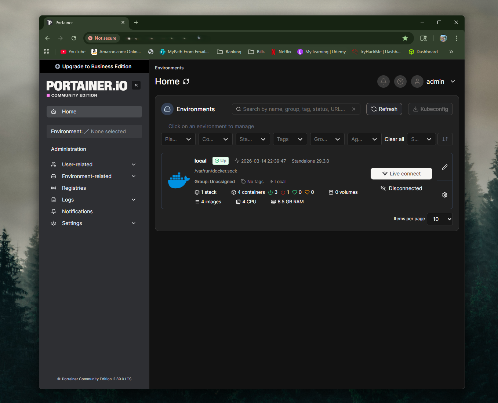
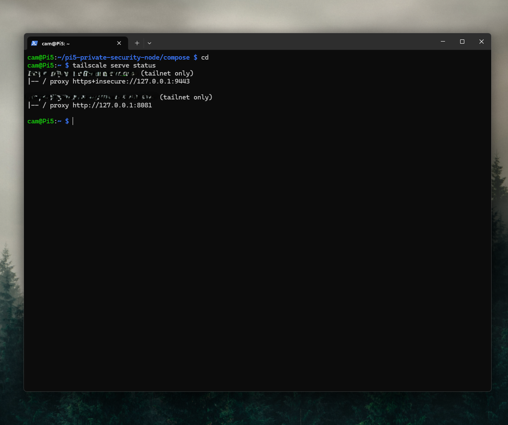
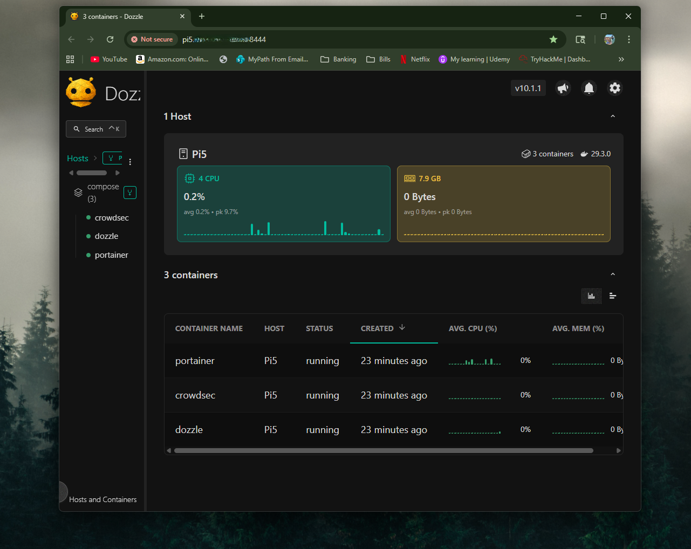
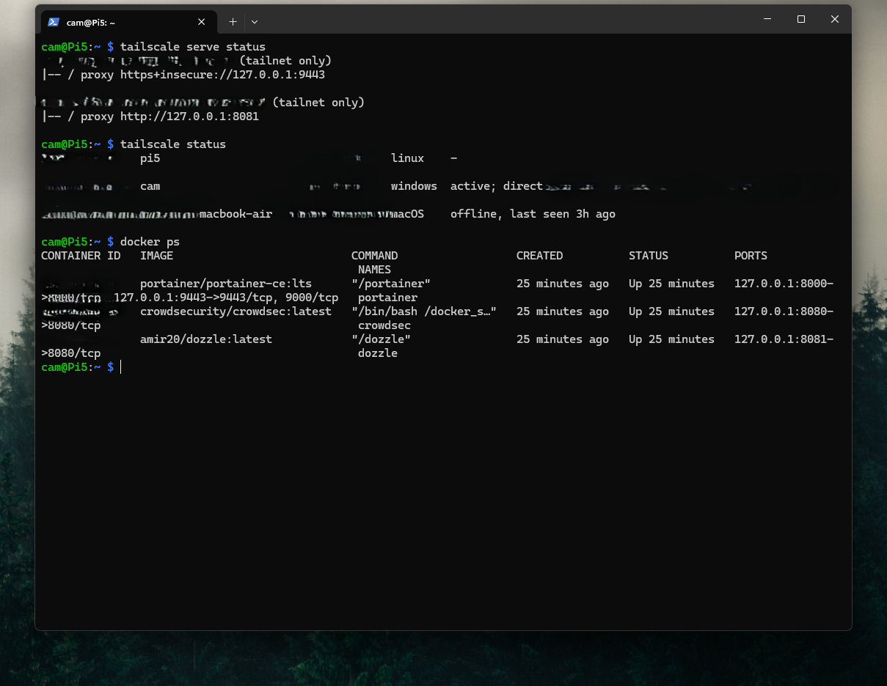

# Pi 5 Tailscale-Only Admin Hardening Lab

## Overview

Hardened a Raspberry Pi 5 private security operations node by restricting Portainer and Dozzle access to Tailscale-only private URLs using Tailscale Serve.

The goal of this project was to improve the security posture of the Pi 5 node by reducing exposure of sensitive administrative interfaces. Instead of continuing to access Portainer and Dozzle through direct LAN IP and port combinations, this project moved those interfaces behind private tailnet-only access.

This lab demonstrates practical skills in service hardening, private service publishing, Tailscale administration, and security-focused homelab design.

* * *

## Architecture

Raspberry Pi 5  
↓  
Portainer running locally on the Pi  
Dozzle running locally on the Pi  
↓  
Tailscale Serve  
↓  
Private tailnet-only URLs  
↓  
Windows desktop and MacBook administration

Component | Description
--- | ---
Host Device | Raspberry Pi 5
Administrative Services | Portainer and Dozzle
Private Access Layer | Tailscale Serve
Client Devices | Windows 11 desktop and MacBook Air
Primary Goal | Restrict admin tools to trusted devices inside the tailnet

## Objectives

- Keep Portainer and Dozzle running locally on the Pi 5
- Enable MagicDNS and HTTPS support in Tailscale
- Publish Portainer privately with Tailscale Serve
- Publish Dozzle privately with Tailscale Serve
- Access both services only from trusted tailnet devices
- Improve the security posture of the Pi 5 private security node

* * *

## Step 1 — Initial Validation

The lab began by confirming that the Pi 5 was reachable over Tailscale and that the Portainer and Dozzle containers were already running correctly.

Initial validation included:

- SSH access over Tailscale
- reviewing Tailscale status
- confirming the required containers were running

### SSH into Pi 5 over Tailscale

### Tailscale Status

### Containers Running

* * *

## Step 2 — Tailnet DNS and HTTPS Preparation

Tailscale Serve requires tailnet DNS and HTTPS support so services can be published privately with proper TLS inside the tailnet.

This phase included:

- enabling MagicDNS
- enabling HTTPS certificates
- reviewing the Machines page for the Pi 5’s tailnet identity

### Tailscale DNS and HTTPS Enabled

### Tailscale Machines Page

* * *

## Step 3 — Portainer Private Publishing

Portainer was published through Tailscale Serve so it could be reached privately within the tailnet instead of through a directly accessed LAN port.

This phase included:

- mapping the local Portainer service to Tailscale Serve
- reviewing the Serve configuration
- validating private tailnet access to Portainer

### Portainer Serve Status

### Portainer via Tailscale Serve

* * *

## Step 4 — Dozzle Private Publishing

Dozzle was published through Tailscale Serve on a separate private service port so it could also be reached only from devices inside the tailnet.

This phase included:

- mapping the local Dozzle service to Tailscale Serve
- reviewing the updated Serve configuration
- validating private tailnet access to Dozzle

### Dozzle Serve Status

### Dozzle via Tailscale Serve

* * *

## Step 5 — Final Validation

After both services were published privately, the final Tailscale Serve configuration was reviewed to confirm the Pi 5 was now acting as a private admin service host for trusted devices only.

### Final Serve Status

* * *

## Why This Project Matters

Portainer and Dozzle are useful administrative tools, but they should be treated as sensitive interfaces rather than casually exposed services.

This project improved the security posture of the Pi 5 node by shifting the management model from:

- direct LAN IP and port access

to:

- Tailscale-authenticated private access inside the tailnet

That made the environment more intentional and more aligned with security-focused infrastructure design.

* * *

## Challenges / Troubleshooting

A few areas required extra attention during the build:

- understanding that Tailscale Serve requires MagicDNS and HTTPS support
- identifying the correct local service ports for Portainer and Dozzle
- confirming the Pi 5’s tailnet DNS identity
- validating that services were being reached through Tailscale rather than normal LAN access habits
- making sure the final admin workflow used private tailnet URLs consistently

These troubleshooting steps helped reinforce secure access design, service hardening, and practical private publishing concepts.

* * *

## What I Learned

- Tailscale Serve is a strong way to share internal services privately inside a tailnet
- sensitive admin tools such as Portainer and Dozzle should not be treated like ordinary open web apps
- private service publishing improves the security story of a homelab significantly
- access design matters just as much as installing the service itself
- a private infrastructure node becomes much stronger when its admin surfaces are intentionally restricted

* * *

## Skills Demonstrated

- Private service publishing
- Tailscale administration
- Access hardening
- Secure infrastructure design
- Homelab security improvement
- Cross-platform private administration

* * *

## Outcome

Successfully hardened a Raspberry Pi 5 private security operations node by restricting Portainer and Dozzle access to Tailscale-only private URLs using Tailscale Serve. This improved the security posture of the node and created a more intentional private administration workflow for trusted devices.

* * *

## Future Improvements

Planned future enhancements include:

- apply the same private access model to additional internal services
- add policy-based access restrictions for more granular tailnet control
- document a full private admin workflow across the Pi 5, VPS, Windows desktop, and MacBook
- evaluate reducing or eliminating normal LAN admin access further
- add notification tooling such as ntfy for private service health and security events
