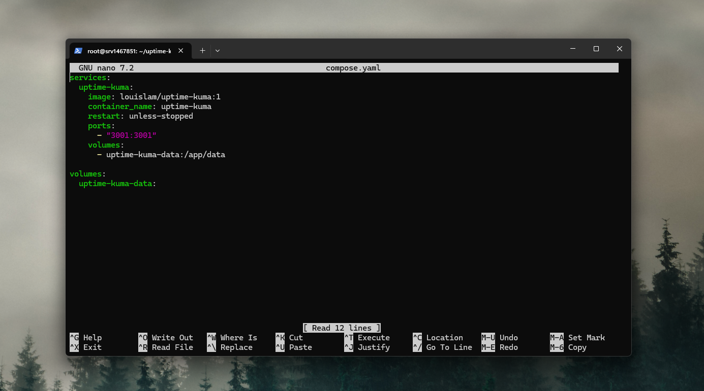
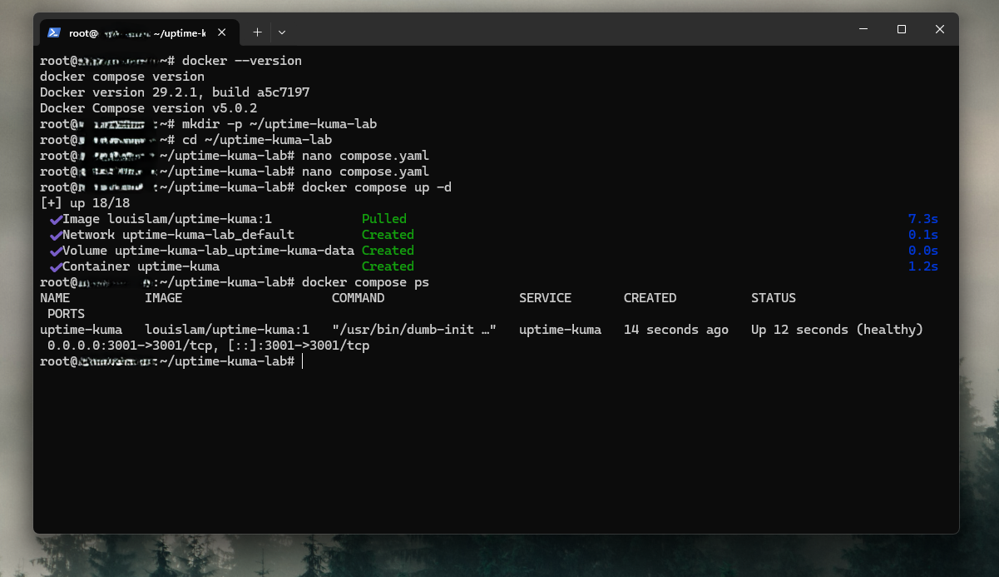
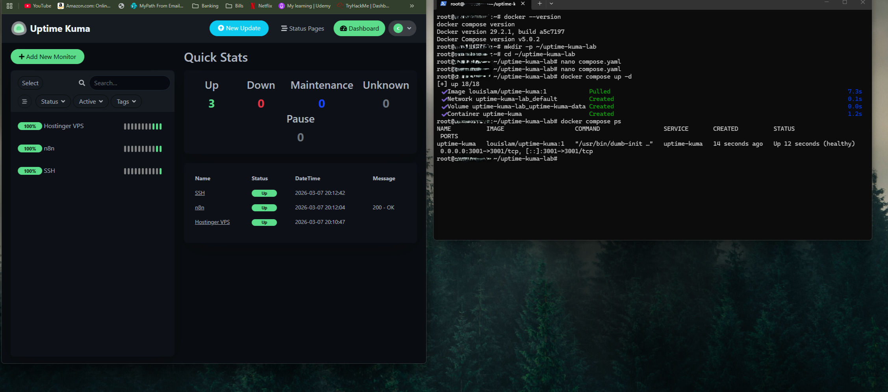
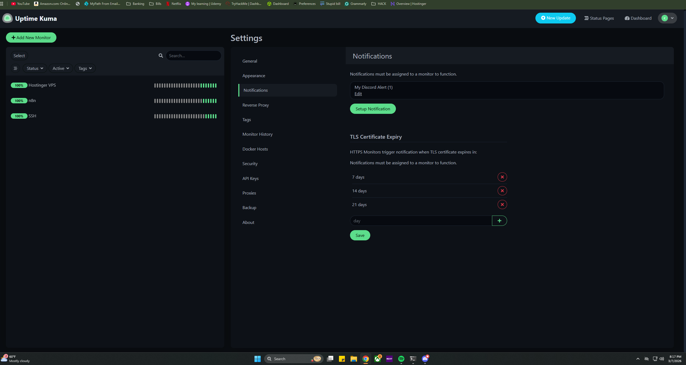
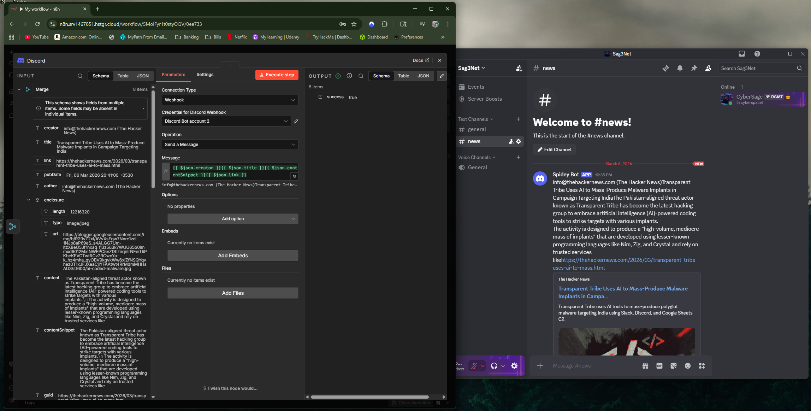
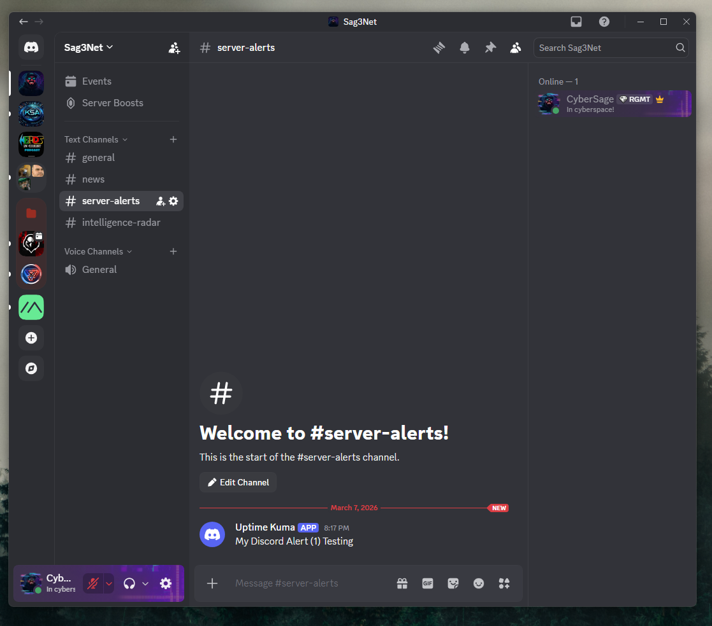

# Service Monitoring and Mobile Alerting Lab

## Overview

This lab documents the deployment of a self-hosted monitoring and alerting system on a Hostinger VPS using Docker and Uptime Kuma.

The project monitors server services and endpoints, detects downtime, and sends alerts to a private Discord server for mobile visibility from an iPhone.

This lab demonstrates practical skills in VPS administration, Docker deployment, service monitoring, and remote alert delivery.

---

## Architecture

Hostinger VPS
   ↓
Docker
   ↓
Uptime Kuma
   ↓
Discord Webhook
   ↓
iPhone Notifications
| Component          | Description   |
| ------------------ | ------------- |
| Hosting Provider   | Hostinger VPS |
| Operating System   | Ubuntu VPS    |
| Container Platform | Docker        |
| Monitoring Tool    | Uptime Kuma   |
| Alert Platform     | Discord       |
| Mobile Device      | iPhone        |
## Objectives

- Deploy Uptime Kuma on a VPS using Docker  
- Monitor server services and endpoints  
- Configure Discord alert delivery  
- Enable mobile notifications  
- Document the system as a HomeLab project  

---

## Step 1 — VPS Access

The project was deployed on a Hostinger VPS and managed remotely through SSH.

Initial setup included:

- Connecting to the VPS  
- Verifying Docker availability  
- Preparing the server for container deployment  

---

## Step 2 — Docker Setup

Docker was used to deploy Uptime Kuma as a containerized service.

A Docker Compose configuration was created to run the service with persistent storage using a named volume.

### Docker Compose File

### Running Container

---

## Step 3 — Uptime Kuma Deployment

Uptime Kuma was deployed using Docker Compose and exposed on port **3001**.

The web interface was accessed through the VPS IP address to complete setup and create the administrator account.

---

## Step 4 — Monitor Configuration

Several monitors were created to track system availability.

Example monitors included:

- VPS ping monitor  
- n8n HTTP monitor  
- SSH TCP port monitor  

These monitors provided basic visibility into the health of the server and hosted services.

### Uptime Kuma Dashboard

---

## Step 5 — Discord Notifications

A Discord webhook was created in a private Discord server and configured inside Uptime Kuma.

This enabled automatic alert delivery when a monitored service changed status.

### Discord Notification Setup

---

## Step 6 — Mobile Alerting

Discord alerts were received on an iPhone using the Discord mobile app.

This created a lightweight mobile monitoring solution for remote infrastructure visibility.

### Discord Output

### Discord Alert Example

---

## Skills Demonstrated

- VPS administration  
- SSH remote management  
- Docker container deployment  
- Service uptime monitoring  
- Discord webhook integration  
- Mobile alerting  
- HomeLab documentation  

---

## Outcome

The final system successfully monitored services running on the Hostinger VPS and sent alerts to Discord for mobile access.

This project created a foundation for future infrastructure monitoring and server operations labs.

---

## Future Improvements

Planned future enhancements include:

- Monitoring additional Docker containers  
- Creating a private status page  
- Adding more alert channels  
- Integrating workflow failure alerts from n8n  
- Adding server resource monitoring
