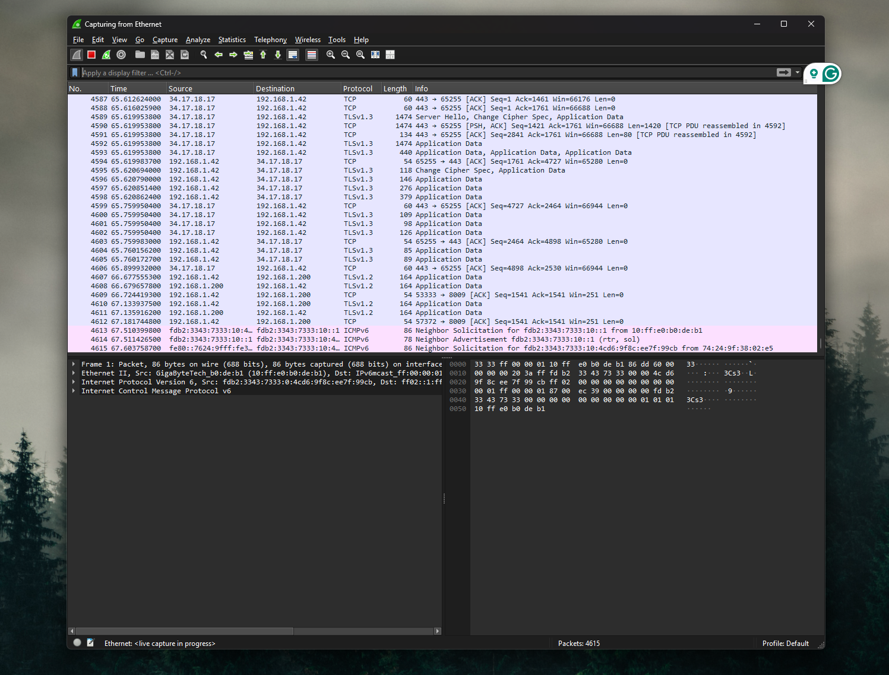
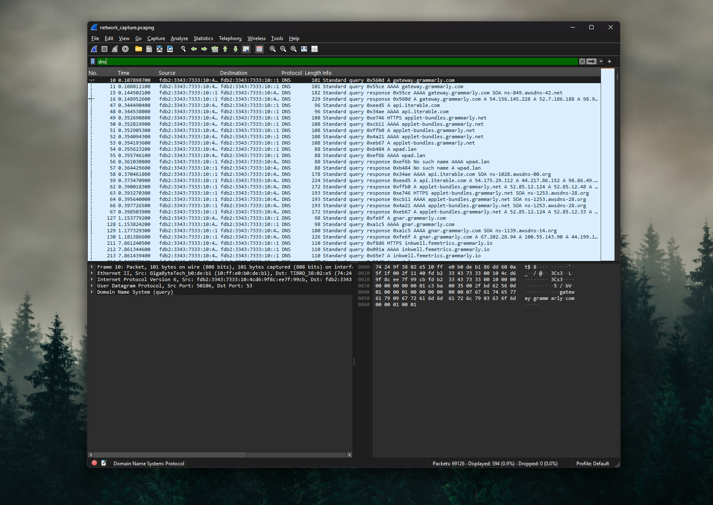
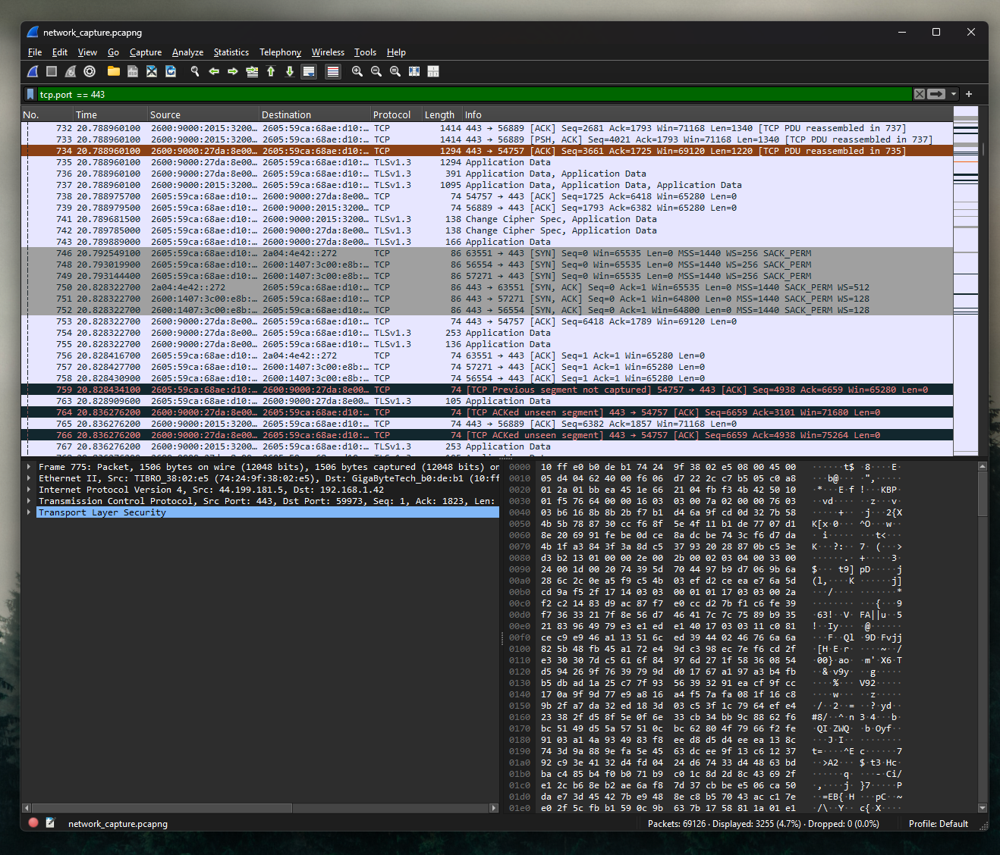

# Wireshark Network Traffic Analysis Lab

## Overview

This lab explores network packet capture and analysis using Wireshark. The objective is to observe real network traffic, analyze DNS requests, and understand how devices communicate across a network.

Packet capture and analysis are fundamental skills used by network engineers and cybersecurity analysts to troubleshoot connectivity issues and investigate suspicious traffic.

---

## Lab Objectives

- Capture live network traffic
- Analyze DNS queries
- Examine HTTPS communication
- Identify source and destination IP addresses
- Explore packet structure

---

## Tools Used

- Wireshark
- Local computer network interface

---

## Capturing Network Traffic

Wireshark was used to capture packets from the active network interface.

Steps:

1. Open Wireshark
2. Select the active interface
3. Start packet capture
4. Generate traffic by browsing websites
5. Stop the capture

---

## DNS Traffic Analysis

Using the filter:

dns

Wireshark displays DNS queries and responses.

Example observations:

- Client requests IP address for a domain
- DNS server returns the resolved IP address

This demonstrates the domain name resolution process.

---

## HTTPS Traffic Analysis

HTTPS traffic was filtered using:

tcp.port == 443

This revealed encrypted communication between the client and remote servers.

Although the payload is encrypted, metadata such as IP addresses and packet size can still be analyzed.

---

## Packet Inspection

Each packet contains detailed information including:

- source IP address
- destination IP address
- protocol type
- packet length

Examining these fields helps understand how network communication occurs.

---

## Skills Demonstrated

- Packet capture
- DNS analysis
- Network troubleshooting
- Understanding network protocols
- Traffic inspection

---

## Screenshots

### Packet Capture Running

### DNS Query Filtering

### HTTPS Traffic

